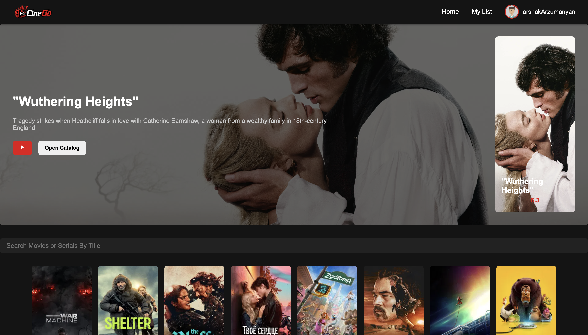
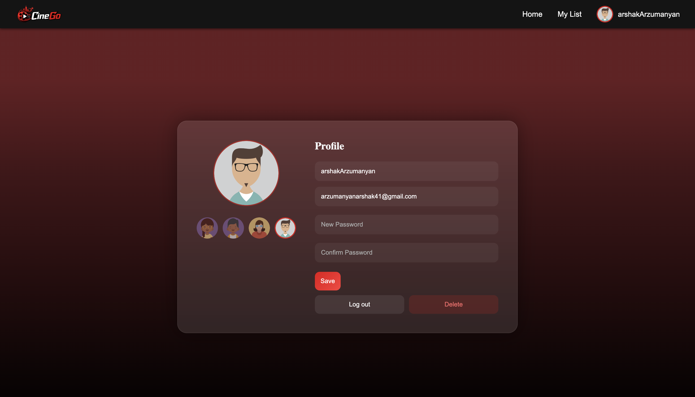

# Cinego-App 🎬

Cinego-App is a modern web application for movie enthusiasts, built with **React.js**, **JavaScript**, **HTML**, and **CSS**. It allows users to explore movies, view details, and manage their favorites with a sleek, Netflix-inspired interface.

## Features ✨

- Browse popular, trending, and newly released movies.
- Search movies by title.
- View detailed information about each movie.
- Add movies to your favorites list.
- User registration and login with avatar selection.
- Responsive, clean, and modern UI with smooth animations.
- Works seamlessly on desktop and mobile devices.

_(Replace the paths with your actual screenshot files.)_

## Technologies 💻

- **React.js** – Front-end library for building UI.
- **JavaScript** – App logic and interactivity.
- **HTML & CSS** – Structure and styling.
- **Redux / React Context** – State management.
- **Axios / Fetch API** – Fetching movie data from external APIs.

## Screenshots 🖼️

Here you can showcase your app:

  
  


## Installation 🚀

1. Clone the repository:
   ```bash
   git clone https://github.com/arzumanyanarshak41-dev/cinego-app.git
   ```
